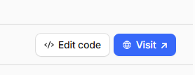

# Hyper Personalisation Lab Guide

## Prerequisites
- Git
- Node.js
- Cloudflare Account & Sandbox
- Node.js 22.x
- Internet connection

## About this project
This project contains a safety reporting application that allows users to submit safety reports and view them in a list. The application is built using Next.js and in intended to be deployed to Cloudflare Workers (though deployment to Cloudflare Containers is also possible). The database that stores all reports is Cloudflare D1. The application is hyper personalised using Cloudflare Workers and D1. 

## Lab objective
The objective of this lab is to understand how to use Cloudflare Durable Objects, Cloudflare AI Gateway, and Cloudflare Workers AI to develop a new AI powered hyper personalization feature.

What will the new feature do?
The new feature will use AI to analyze a user's past reports and make recommendations to the user on how to improve their report writing in future reports.

## Lab steps

### Step 0: Initial Project Setup

Before you begin, ensure you have all prerequisite software installed (Git, Node.js 22.x, and a Cloudflare account).

1. **Clone the repository**  
   Open a terminal and run the following command to clone the project to a directory of your choice:
   ```bash
   git clone https://github.com/SnowDroids/cf-hyper-personalisation.git
   ```

2. **Open the project in your code editor**  
   Navigate to the cloned project directory and open it in your preferred code editor.

3. **Install dependencies**  
   In a terminal within your code editor (or a separate terminal), navigate to the project directory and run:
   ```bash
   npm install
   ```
   This will download and install all required package dependencies.

4. **Run the typegen command**
   ```bash
   npm run cf-typegen
   ```
   This will generate the type definitions for the Cloudflare environment.

5. **Login to Cloudflare**  
   In your terminal, authenticate with Cloudflare by running:
   ```bash
   npx wrangler login
   ```
   Follow the prompts to complete the authentication process.

---

### Step 1: Database Setup

The application uses Cloudflare D1, a serverless SQL database. You'll need to create and configure the database before deploying.

1. **Create the D1 database**  
   In your terminal, run the following command to create a new D1 database:
   ```bash
   npx wrangler d1 create safety-reports-db
   ```
   
   This will output information including a `database_id`. Wrangler should offer to add it to the `wrangler.jsonc` file for you, which you can accept (recommended). But if it doesn't, or if you accidentally reject it, you can add it manually.
   
   Example output:
   ```jsonc
   {
    "d1_databases": [
        {
        "binding": "safety_reports_db",
        "database_name": "safety-reports-db",
        "database_id": "*******-****-****-****-************"
        }
    ]
   }
   ```

2. **Update the Wrangler configuration**  
   Open the `wrangler.jsonc` file in your project and locate the `d1_databases` section. Replace the placeholder `database_id` with the actual ID you copied from the previous step:
   ```jsonc
   "d1_databases": [
     {
       "binding": "DB",
       "database_name": "safety-reports-db",
       "database_id": "YOUR-ACTUAL-DATABASE-ID-HERE"
     }
   ]
   ```

3. **Initialize the database schema**  
   Run the following command to create the reports table in your local and remote databases:
   ```bash
   npx wrangler d1 execute safety-reports-db --file=./schema.sql
   npx wrangler d1 execute safety-reports-db --remote --file=./schema.sql
   ```
   
   **NOTE**: At a later step when we run this app locally, using the `npx wrangler preview` command, wrangler will connect to a local D1 database instance that it dynamically creates for us. At an even later step, when we actually deploy the app to Clouflare, this app will connect to the remote D1 database, which is hosted on Cloudflare's servers.

4. **Verify the databases setup**  
   Confirm that the table was created successfully by running:
   ```bash
   npx wrangler d1 execute safety-reports-db --command="SELECT * FROM reports"
   npx wrangler d1 execute safety-reports-db --remote --command="SELECT * FROM reports"
   ```
   
   You should see an empty result set (no errors), confirming the table exists.

---

### Step 2: Initial Deployment

1. **Preview the application**  
   Preview the application by running:
   ```bash
   npm run preview
   ```
   Wait for the preview to start. Wrangler will output the URL of your app that you can open in your browser. Just verify that you can browse to the app, create/submit a report, and view that report in the "Open Report Archive" section. If all that looks okay, proceed to the next step.

    **NOTE**: Currently projects created with wrangler or OpenNext don't support HSR (Hot Module Replacement). This means that you will need to restart the preview server every time you make changes to the code.

2. **Deploy the starter project**  
   Deploy the application to Cloudflare Workers by running:
   ```bash
   npx wrangler deploy
   ```
   Wait for the deployment to complete. Wrangler will output the URL of your deployed worker.
   <p>Be sure to take note of the name of the worker that was deployed as it will be used in the next step.


3. **View your deployed application**  
   - Open your browser and navigate to: [https://dash.cloudflare.com/?to=/:account/workers-and-pages](https://dash.cloudflare.com/?to=/:account/workers-and-pages)
   - Locate and click on the worker you just deployed from the list
   - In the upper right corner of the page, click the blue **"Visit"** button to open your live application


---
